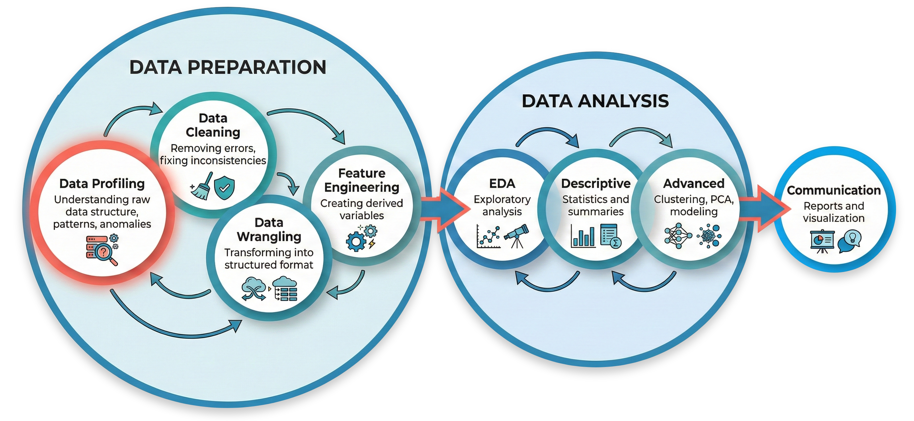

# WhatsApp DS Analytics

> Pipeline completo de Data Science para análise de conversas do WhatsApp.

## 📋 Sobre

Este projeto demonstra um pipeline completo de **Data Science**, desde a investigação inicial de dados brutos até análises avançadas com clustering e visualizações. O caso de estudo é um export do WhatsApp com \~92.000 mensagens ao longo de 1 ano.

O projeto foi desenvolvido para ser **reprodutível** — permite rodar o pipeline com novos exports e integrar os resultados à base existente.

## 🔄 Pipeline



### Etapas detalhadas

| Fase | Etapa | Descrição |
|------------------|---------------------|---------------------------------|
| **Preparation** | Data Profiling | Investigação da estrutura do arquivo bruto |
|  | Data Cleaning | Remoção de caracteres invisíveis, normalização |
|  | Data Wrangling | Parsing, vinculação de mídia, transcrição |
|  | Feature Engineering | Criação de 35 variáveis derivadas |
| **Analysis** | EDA | Análise exploratória |
|  | Descritiva | Estatísticas e distribuições |
|  | Avançada | Clustering, PCA, radar charts |

## 📁 Estrutura

```         
whatsapp-ds-analytics/
│
├── .env.example                 # Template de configuração
├── index.qmd                    # Documento principal (overview)
│
├── assets/                      # Recursos estáticos
│   └── images/                  # Diagramas, screenshots
│
├── src/                         # Módulos Python
│   ├── config.py                # Configurações (lê do .env)
│   ├── profiling.py             # Funções de investigação
│   ├── cleaning.py              # Limpeza de dados
│   ├── parsing.py               # Parser txt → DataFrame
│   ├── wrangling.py             # Vinculação e transcrição
│   ├── features.py              # Feature engineering
│   └── audit.py                 # Auditoria de transformações
│
├── notebooks/                   # Documentos Quarto
│   ├── 00-data-profiling.qmd
│   ├── 01-data-cleaning.qmd
│   ├── 02-data-wrangling.qmd
│   ├── 03-feature-engineering.qmd
│   ├── 04-eda.qmd
│   └── 05-advanced-analysis.qmd
│
├── data/                        # 🚫 Não versionado
│   ├── raw/                     # Exports brutos por período
│   ├── interim/                 # Arquivos intermediários
│   ├── processed/               # DataFrames por execução
│   └── integrated/              # Base consolidada
│
├── analysis/                    # 🚫 Não versionado
│
└── docs/
    ├── SETUP-GUIDE.md           # Guia de instalação
    └── data-dictionary.md       # Dicionário de dados
```

## 🚀 Quick Start

``` bash
# Clone e configure
git clone https://github.com/mrlnlms/whatsapp-ds-analytics.git
cd whatsapp-ds-analytics

# Setup do ambiente
python3 -m venv venv
source venv/bin/activate
pip install -r requirements.txt
python -m ipykernel install --user --name=whatsapp-ds --display-name="WhatsApp DS"

# Configure seus paths
cp .env.example .env
# Edite o .env com seus paths

# Rode o projeto
quarto preview
```

Veja o [Guia de Setup](docs/SETUP-GUIDE.md) completo para mais detalhes.

## 🛠️ Tecnologias

-   **Python 3.11+**
-   **Quarto** — Documentação reprodutível

### Data Manipulation

-   **Pandas / NumPy** — Manipulação e análise de dados

### Visualization

-   **Matplotlib / Seaborn / Plotly** — Gráficos e visualizações
-   **WordCloud** — Nuvens de palavras

### Machine Learning & Statistics

-   **Scikit-learn** — Clustering, PCA, métricas
-   **Prince** — Análise de Correspondência Múltipla (MCA)
-   **SciPy** — Estatística

### NLP & Sentiment Analysis

-   **Transformers / PyTorch** — Análise de sentimento (BERT)
-   **Groq API (Whisper)** — Transcrição de áudios/vídeos

## 📝 Documentação

-   [Guia de Setup](docs/SETUP-GUIDE.md) — Instalação e configuração
-   [Dicionário de Dados](docs/data-dictionary.md) — Descrição das variáveis
-   [00 - Data Profiling](notebooks/00-data-profiling.qmd)
-   [01 - Data Cleaning](notebooks/01-data-cleaning.qmd)
-   [02 - Data Wrangling](notebooks/02-data-wrangling.qmd)
-   [03 - Feature Engineering](notebooks/03-feature-engineering.qmd)
-   [04 - EDA](notebooks/04-eda.qmd)
-   [05 - Advanced Analysis](notebooks/05-advanced-analysis.qmd)

## 📌 Highlights

-   **Pipeline reprodutível** — rode com novos exports e integre à base
-   **Configuração via `.env`** — um só lugar pra ajustar paths
-   **Transcrição automática** de áudios/vídeos via Groq API
-   **Módulos reutilizáveis** com funções bem documentadas

## 🔒 Privacidade

Os dados (`data/` e `analysis/`) **não são versionados** por conterem informações pessoais.

------------------------------------------------------------------------

*Desenvolvido por [\@mrlnlms](https://github.com/mrlnlms)*