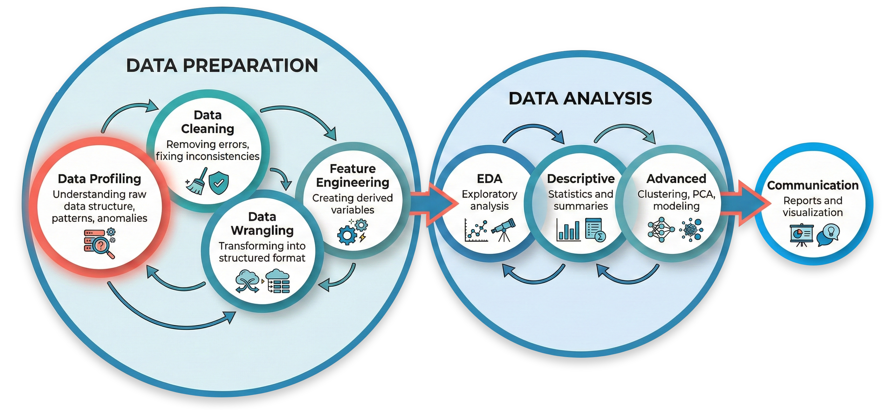

# WhatsApp Interaction Analysis

> End-to-end data science pipeline for WhatsApp conversation analysis — profiling, cleaning, sentiment analysis, embeddings, clustering. Python + R, Quarto-rendered, CI/CD-deployed.

**[View the live site](https://mrlnlms.github.io/whatsapp-interaction-analysis/)**

## About

Full data science pipeline for WhatsApp conversation analysis. The case study is a single export of ~92,000 messages spanning one year.

The project is designed to be **reproducible** — you can run the pipeline against new exports and integrate the results with the existing base.

## Pipeline



| Phase | Stage | Description |
|------|-------|-----------|
| **Preparation** | Data Discovery | Initial exploration of the raw export |
| | Data Profiling | Systematic pattern investigation |
| | Data Cleaning | Invisible character removal, normalization |
| | Data Wrangling | Parsing, media linking, transcription |
| | Feature Engineering | 35+ derived variables |
| | Model Features | Multi-model sentiment analysis, embeddings |
| **Analysis** | EDA | Exploratory analysis by dimension (temporal, interaction, content) |
| | Advanced Analysis | Semantic clustering, PCA, MCA, N-grams, TF-IDF |
| **Findings** | Consolidated insights | Overview, dynamics, sentiment, themes, styles — written in prose |

## Structure

```
whatsapp-interaction-analysis/
│
├── index.qmd                         # Main document (overview)
├── .env.example                       # Configuration template
├── pyproject.toml                     # Packaging and dependencies
├── _quarto.yml                        # Main Quarto config
├── docs/BACKLOG.md                    # Prioritized backlog
├── docs/CHANGELOG.md                  # Project phase history
│
├── whatsapp/                          # Main package
│   ├── __init__.py                    # Version and metadata
│   ├── __main__.py                    # python -m whatsapp
│   ├── cli/                           # CLI (whatsapp-interaction)
│   │   ├── __init__.py                # Typer app + run command
│   │   ├── helpers.py                 # Shared helpers
│   │   ├── prepare.py                 # Commands: clean, wrangle, transcribe
│   │   ├── process.py                 # Commands: sentiment, embeddings
│   │   └── _status.py                 # Command: status
│   └── pipeline/                      # Pipeline modules
│       ├── config.py                  # Configuration (reads from .env)
│       ├── profiling.py               # Investigation functions
│       ├── cleaning.py                # Cleaning pipeline (7 stages)
│       ├── wrangling.py               # Wrangling pipeline (6 stages)
│       └── utils/                     # Utilities
│           ├── audit.py               # Audit system
│           ├── dataframe_helpers.py   # DataFrame helpers
│           ├── file_helpers.py        # File helpers
│           └── text_helpers.py        # Text helpers
│
├── scripts/                           # Standalone scripts
│   ├── transcribe_media.py            # Transcription via Groq/Whisper
│   ├── sentiment_*.py                 # Sentiment analysis (RoBERTa, DistilBERT, DeBERTa, ensemble)
│   ├── generate_embeddings*.py        # Embedding generation (mpnet, MiniLM, DistilUSE)
│   ├── compare_embeddings_models.py   # Embedding model comparison
│   ├── compare_embedding_dimensions.py # Embedding dimension comparison
│   ├── generate_timeline_chart.py     # "One Year in Data" timeline chart
│   └── generate_sample_data.py        # Synthetic dataset generator (for demo)
│
├── notebooks/                         # Quarto documents (see table below)
│
├── tests/                             # Unit tests (pytest)
│   ├── test_cleaning.py               # Cleaning pipeline tests
│   ├── test_wrangling.py              # Parsing and classification tests
│   └── test_cli.py                    # CLI tests
│
├── data/                              # Not versioned (personal data)
│   ├── raw/                           # Raw exports per period
│   ├── interim/                       # Intermediate files
│   ├── processed/                     # DataFrames per run
│   ├── external/                      # External context data
│   └── integrated/                    # Consolidated base
│
├── docs/
│   ├── SETUP-GUIDE.md                 # Installation guide
│   ├── INCREMENTAL-GUIDE.md           # Guide for new exports
│   └── data-dictionary.md             # Data dictionary
│
├── .github/workflows/
│   ├── tests.yml                      # Unit tests (Python 3.11/3.12)
│   └── publish.yml                    # Quarto site build (Python + R) → GitHub Pages
│
└── analysis/                          # Not versioned (outputs)
```

## Notebooks

### Preparation

| # | Notebook | Description |
|---|---------|-----------|
| 00 | [Data Discovery](notebooks/00-data-discovery.qmd) | Initial file exploration |
| 00 | [Data Profiling](notebooks/00-data-profiling.qmd) | Systematic investigation |
| 01 | [Data Cleaning](notebooks/01-data-cleaning.qmd) | Cleaning and normalization |
| 02 | [Data Wrangling](notebooks/02-data-wrangling.qmd) | Parsing, media, transcription |
| 02.1 | [EDA — Data Wrangling](notebooks/02.1-EDA-data-wrangling.qmd) | Post-wrangling EDA |
| 02.3 | [EDA — Content & Interaction](notebooks/02.3-EDA-conteudo-interacao.qmd) | Content analysis |
| 03 | [External Context](notebooks/03-contexto-externo.qmd) | External data integration and relationship phases |
| 04 | [Feature Engineering](notebooks/04-feature-engineering.qmd) | 35+ derived variables |

### Models (optional)

| # | Notebook | Description |
|---|---------|-----------|
| 04 | [Model Features](notebooks/04-model-features.qmd) | ML feature overview |
| 04a | [Sentiment — RoBERTa](notebooks/04a-sentiment-roberta.qmd) | Twitter-RoBERTa sentiment |
| 04b | [Sentiment — DistilBERT](notebooks/04b-sentiment-distilbert.qmd) | DistilBERT sentiment |
| 04c | [Sentiment — DeBERTa](notebooks/04c-sentiment-deberta.qmd) | DeBERTa sentiment |
| 04d | [Sentiment — Comparison](notebooks/04d-sentiment-comparison.qmd) | Cross-model comparison |
| 04e | [Sentiment — Ensemble](notebooks/04e-sentiment-ensemble.qmd) | 3-model ensemble |
| 04f | [Embeddings — mpnet](notebooks/04f-embeddings-mpnet.qmd) | all-mpnet-base-v2 |
| 04g | [Embeddings — MiniLM](notebooks/04g-embeddings-minilm.qmd) | all-MiniLM-L6-v2 |
| 04h | [Embeddings — DistilUSE](notebooks/04h-embeddings-distiluse.qmd) | distiluse-base-multilingual |
| 04i | [Embeddings — Comparison](notebooks/04i-embeddings-comparison.qmd) | Cross-model comparison |

### Analysis

| # | Notebook | Description |
|---|---------|-----------|
| 05 | [EDA — Overview](notebooks/05-eda-overview.qmd) | Exploratory analysis with context |
| 05.1 | [EDA — Temporal](notebooks/05.1-eda-temporal.qmd) | Temporal patterns |
| 05.2 | [EDA — Interaction](notebooks/05.2-eda-interacao.qmd) | Interaction dynamics |
| 05.3 | [EDA — Content](notebooks/05.3-eda-conteudo.qmd) | Content analysis |
| 06 | [Advanced Analysis](notebooks/06-advanced-analysis.qmd) | Semantic clustering, N-grams, TF-IDF |

### Findings

Synthesis layer in prose — consolidates pipeline findings into interpretive conclusions.

| # | Notebook | Description |
|---|---------|-----------|
| 07 | [Findings — Overview](notebooks/07-findings-overview.qmd) | Year overview + 4-axis synthesis |
| 08 | [Findings — Dynamics](notebooks/08-findings-dinamica.qmd) | Volume, rhythm and temporal patterns |
| 09 | [Findings — Sentiment](notebooks/09-findings-sentimento.qmd) | Dominant tone and emotional evolution |
| 10 | [Findings — Themes](notebooks/10-findings-temas.qmd) | Semantic clustering (k=10) and characterization |
| 11 | [Findings — Styles](notebooks/11-findings-estilos.qmd) | P1 vs P2: vocabulary, emojis, punctuation |

### Lab

Experimental notebooks — explore alternative approaches and showcase the **R + Python integration** that defines the project's evolution. Rendered alongside the main pipeline via Quarto.

**R + Python**

| Notebook | Description |
|----------|-------------|
| [Visualization Gallery](notebooks/data-viz-experiments/galeria-whatsapp-completa.qmd) | Creative WhatsApp viz ideas (ggplot2, gganimate, ggbump, ggwordcloud) |
| [R Charts](notebooks/data-viz-experiments/r-graficos-legais.qmd) | ggplot2 + plotly experiments |
| [R Snippets](notebooks/data-viz-experiments/r-test-snippet.qmd) | Reusable ggplot patterns |
| [Python ↔ R (reticulate)](notebooks/data-viz-experiments/python-r-test.qmd) | Mixing Python and R in the same document |

**Python variants**

| Notebook | Description |
|----------|-------------|
| [Cleaning — Static](notebooks/experiments/01-data-cleaning_static.qmd) | Cleaning iteration (static output) |
| [Cleaning — Hardened](notebooks/experiments/01-data-cleaning_harded.qmd) | Cleaning with stricter cache settings |
| [Wrangling — v1](notebooks/experiments/02-data-wrangling__.qmd) | Early wrangling iteration |
| [Wrangling — Backup](notebooks/experiments/02-data-wrangling_bkp.qmd) | Wrangling backup snapshot |

## Quick Start

```bash
git clone https://github.com/mrlnlms/whatsapp-interaction-analysis.git
cd whatsapp-interaction-analysis

python3 -m venv .venv
source .venv/bin/activate

# Recommended: notebooks extra (covers viz, jupyter, scipy, sklearn)
pip install -e ".[notebooks]"

# Add ML on demand (transformers + torch, ~600 MB)
pip install -e ".[notebooks,ml]"

# Or pick exactly what you need:
# pip install -e ".[viz]"            # only visualization
# pip install -e ".[jupyter]"        # only Jupyter
# pip install -e ".[transcription]"  # only Groq transcription

cp .env.example .env
# Edit .env with your paths

quarto preview
```

### Sample dataset

The repo ships with a synthetic dataset so you can test the pipeline without personal data:

```bash
# Configure .env to use sample data
echo "PROJECT_ROOT=$(pwd)" > .env
echo "DATA_FOLDER=sample" >> .env

# Run the preparation pipeline
whatsapp-interaction prepare clean
whatsapp-interaction prepare wrangle
whatsapp-interaction status
```

The sample dataset (200 messages, 7 days) is generated deterministically by `scripts/generate_sample_data.py`.

See the full [Setup Guide](docs/SETUP-GUIDE.md).

### CLI

```bash
pip install -e .

# Full pipeline
whatsapp-interaction run

# Preparation only (clean → wrangle → transcribe)
whatsapp-interaction prepare

# Individual steps
whatsapp-interaction prepare clean --steps u200e,anonymize
whatsapp-interaction process sentiment --model deberta

# Current state
whatsapp-interaction status
```

### Audio transcription (optional)

```bash
# Add your API key to .env
echo "GROQ_API_KEY=your_key_here" >> .env

# Run the transcription script (~40 min for ~700 files)
python scripts/transcribe_media.py

# Re-render wrangling
quarto render notebooks/02-data-wrangling.qmd
```

The script auto-detects already-transcribed files and resumes where it stopped.

## Tests

```bash
pip install pytest
pytest tests/ -v
```

149 tests covering the cleaning pipeline (`cleaning.py`), parsing/classification (`wrangling.py`) and the CLI. CI runs automatically via GitHub Actions on Python 3.11 and 3.12.

## CI/CD

Two workflows run on every push to `main`:

- **`tests.yml`** — pytest matrix on Python 3.11 and 3.12
- **`publish.yml`** — Quarto build (Python 3.12 + R 4.5 with `tidyverse`, `gganimate`, `ggbump`, `ggtext`, `ggwordcloud`, `plotly`, `reticulate`) → deploy to GitHub Pages

The R toolchain enables the Lab notebooks above to render alongside the Python pipeline in a single CI run.

## Tech Stack

**Core**: Python 3.11+, R 4.5 (CI), Quarto

**Data**: Pandas, NumPy, PyArrow

**Visualization (Python)**: Matplotlib, Seaborn, Plotly, WordCloud

**Visualization (R)**: tidyverse (ggplot2, dplyr, lubridate), gganimate, ggbump, ggtext, ggwordcloud, plotly

**ML/Statistics**: Scikit-learn, Prince (MCA), SciPy

**NLP**: Transformers/PyTorch (sentiment — RoBERTa, DistilBERT, DeBERTa), Sentence-Transformers (embeddings — mpnet, MiniLM, DistilUSE), Groq API/Whisper (transcription)

**Interop**: reticulate (Python in R documents)

## Outputs

The pipeline generates the following files under `data/processed/{export}/`:

| File | Columns | Description |
|---------|---------|-----------|
| `messages.csv` | 8 | Main analysis dataset |
| `messages.parquet` | 8 | Same content, ~3x smaller |
| `messages_full.csv` | 17 | Full version for debugging |
| `chat_complete.txt` | — | Chat with transcriptions |
| `corpus_*.txt` | — | NLP-ready text |

## Documentation

- [Setup Guide](docs/SETUP-GUIDE.md) — Installation and configuration
- [Incremental Guide](docs/INCREMENTAL-GUIDE.md) — How to run with new exports
- [Data Dictionary](docs/data-dictionary.md) — Variable descriptions
- [Pipeline](docs/pipeline.md) — Map of scripts, notebooks and artifacts
- [Backlog](docs/BACKLOG.md) — Next steps and prioritized pending work
- [Changelog](docs/CHANGELOG.md) — Project phase history

## Privacy

Data folders (`data/` and `analysis/`) are not versioned because they contain personal information.

---

*Built by [@mrlnlms](https://github.com/mrlnlms)*
