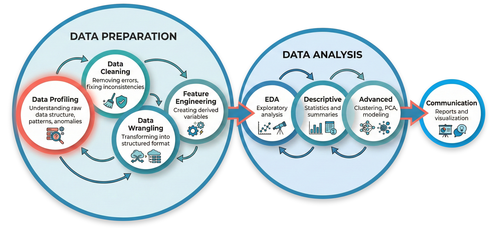
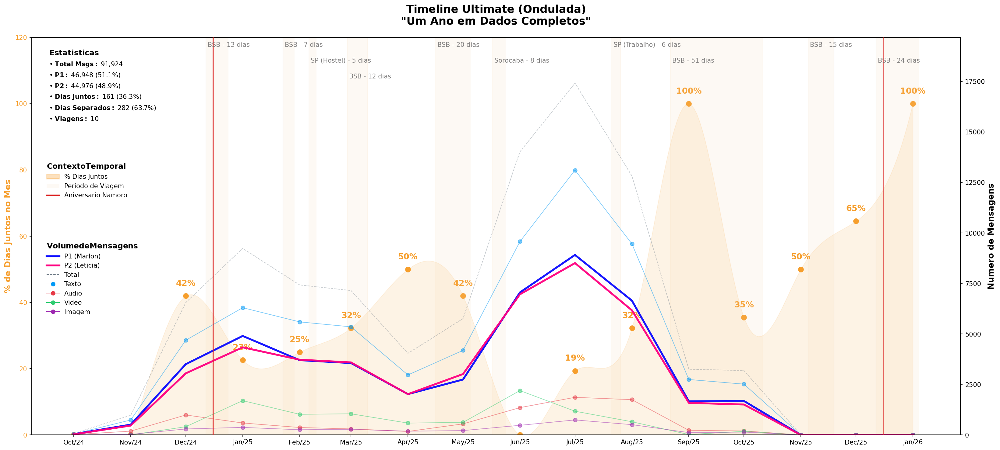

# Introdução

Conversas do WhatsApp são um tesouro de dados sobre nossas interações humanas. Porém, quando exportadas, chegam em um formato que mistura estrutura com caos: timestamps irregulares, caracteres invisíveis, mensagens quebradas em múltiplas linhas, mídias omitidas ou anexadas.

## Contexto

Como estudante de ciência de dados e interessado em análises qualitativas e aprendizado de novas ferramentas, fazer um projeto de data-wrangling com Python nestes dados, incluindo transcrição de mídias e enriquecimento da base, ou seja, dos dados brutos, documentando todo processo usando Quarto (.qmd) parece uma abordagem desafiadora e profissional.

Do ponto de vista técnico, a escolha de trabalhar com este formato semi-estruturado apresentam *edge-cases* bem especificos como caracteres especiais e emojis, tags ou textos de marcação para certos tipos de interação (envio de mensagem de áudio, vídeo, arquivos etc), mensagens fragmentadas, formatos inconsistentes entre outras coisas que iremos explorar tratar neste projeto.

## Objetivo

Transformar um export bruto do WhatsApp (`_chat.txt`) em um dataset estruturado para realizar analises de forma reprodutível, passando por todas as fase de preparação, agregação e enriquecimento dos dados até às suas análises e visualizações. Neste relatório, documentarei cada etapa do processo da pipeline de dados criado exclusivamente para este cenário.

{fig-align="center"}

::: callout-note
### Estudo de caso

Como estudo de caso vou utilizar o histórico de \~14 meses de mensagens entre minha namorada e eu (\~92K mensagens, \~5MB). Para além do aprendizado em ciência de dados e *analytics*, essa escolha se deu por conta de uma ideia que tive de fazer análises textuais sobre nosso primeiro ano de namoro, extraindo visualizações e insights para criar um "*presente digital analítico*" do nosso 1º ano de namoro 😍 🥰. Após preparar os dados iremos vincular as datas de quando estivemos juntos durante este um ano (\~10 viagens em 2025) às mensagens daquele período.

Outros incrementos foram desenvolvidos para agregar a estes dados ainda mais riqueza, como a transcrição automatizada de áudios e vídeos, padronizando toda mídia possível em formato texto.
:::

------------------------------------------------------------------------

# Timeline: Um Ano em Dados

{fig-align="center"}

------------------------------------------------------------------------

# Navegação

## Pipeline Principal

| Fase | Documento | Descrição |
|------|-----------|-----------|
| Discovery | [00-data-discovery](notebooks/00-data-discovery.qmd) | Exploração inicial do arquivo bruto |
| Profiling | [00-data-profiling](notebooks/00-data-profiling.qmd) | Investigação da estrutura do arquivo |
| Cleaning | [01-data-cleaning](notebooks/01-data-cleaning.qmd) | Limpeza e normalização |
| Wrangling | [02-data-wrangling](notebooks/02-data-wrangling.qmd) | Parsing, vinculação de mídia, transcrição |
| Contexto | [03-contexto-externo](notebooks/03-contexto-externo.qmd) | Integração de contexto externo |
| Features | [04-feature-engineering](notebooks/04-feature-engineering.qmd) | Criação de 35+ variáveis derivadas |
| EDA | [05-eda-overview](notebooks/05-eda-overview.qmd) | Análise exploratória com contexto |
| Advanced | [06-advanced-analysis](notebooks/06-advanced-analysis.qmd) | Clustering, N-Grams, TF-IDF |

## Scripts Utilitários

| Script | Descrição |
|-------------------------------|-----------------------------------------|
| [transcribe_media.py](scripts/README.md) | Transcrição de áudios/vídeos via Groq/Whisper API |

## Documentos úteis

-   [Dicionário de Dados](docs/data-dictionary.md)
-   [Como organizar seus dados](data/README.md)
-   [Guia de Setup](docs/SETUP-GUIDE.md)

------------------------------------------------------------------------

# Arquitetura

O projeto segue uma arquitetura modular que separa **lógica** de **apresentação**:

```
whatsapp/pipeline/            # Lógica (módulos Python)
├── config.py                 # Configurações (lê do .env)
├── cleaning.py               # Pipeline de limpeza (7 etapas)
├── wrangling.py              # Pipeline de wrangling (6 etapas)
└── utils/                    # Utilitários
    ├── audit.py              # Sistema de auditoria
    ├── dataframe_helpers.py  # Helpers para DataFrames
    ├── file_helpers.py       # Helpers para arquivos
    └── text_helpers.py       # Helpers para texto

notebooks/                    # Apresentação (Quarto)
├── 01-data-cleaning.qmd      # Configura e executa cleaning
├── 02-data-wrangling.qmd     # Configura e executa wrangling
└── ...

scripts/                      # Executáveis standalone
└── transcribe_media.py       # Roda fora do pipeline (~40 min)
```

## Vantagens

-   **Testável**: Funções isoladas e importáveis
-   **Reutilizável**: Módulos funcionam independente dos notebooks
-   **Configurável**: Ordem das etapas via lista simples
-   **Auditável**: Métricas de cada transformação

------------------------------------------------------------------------

# Estrutura do Projeto

```
whatsapp-interaction-analysis/
├── index.qmd                 # Este documento
├── _quarto.yml               # Configuração do site Quarto
├── .env                      # Configuração local (não versionado)
│
├── whatsapp/                 # Pacote principal
│   ├── cli/                  # CLI (whatsapp-interaction)
│   └── pipeline/             # Módulos do pipeline
│       ├── config.py         # Configurações
│       ├── cleaning.py       # Pipeline de limpeza
│       ├── wrangling.py      # Pipeline de wrangling
│       └── utils/            # Utilitários
│
├── scripts/                  # Scripts standalone
│   └── transcribe_media.py   # Transcrição de mídias
│
├── notebooks/                # Documentos Quarto
│   ├── 00-data-discovery.qmd
│   ├── 00-data-profiling.qmd
│   ├── 01-data-cleaning.qmd
│   ├── 02-data-wrangling.qmd
│   ├── 03-contexto-externo.qmd
│   ├── 04-feature-engineering.qmd
│   ├── 04a-04i (modelos)
│   ├── 05-eda-overview.qmd
│   ├── 05.1-05.3 (EDAs)
│   └── 06-advanced-analysis.qmd
│
├── data/                     # Dados (não versionado)
│   ├── raw/                  # Exports brutos
│   ├── interim/              # Intermediários
│   └── processed/            # Datasets finais
│
├── analysis/                 # Gráficos (não versionado)
│
└── docs/                     # Documentação
    ├── SETUP-GUIDE.md
    └── data-dictionary.md
```

------------------------------------------------------------------------

# Outputs

O pipeline gera os seguintes arquivos em `data/processed/{DATA_FOLDER}/`:

| Arquivo | Descrição | Uso |
|-------------------------|-----------------------------|------------------|
| `messages.csv` | Dataset principal (8 colunas) | **Use este para análises** |
| `messages.parquet` | Mesmo conteúdo, \~3x menor | Performance |
| `messages_full.csv` | Versão completa (17 colunas) | Debug/auditoria |
| `chat_complete.txt` | Chat formatado com transcrições | Leitura |
| `corpus_*.txt` | Textos puros | NLP, word clouds |

------------------------------------------------------------------------

# Quick Start

``` bash
# 1. Configure o ambiente
cp .env.example .env
# Edite .env com seus paths

# 2. (Opcional) Transcreva áudios/vídeos
python scripts/transcribe_media.py

# 3. Rode o pipeline
quarto preview
```

Para mais detalhes, veja o [Guia de Setup](docs/SETUP-GUIDE.md).